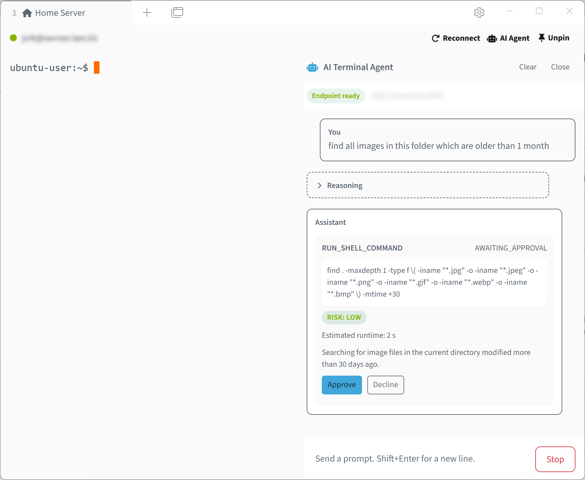

# Tabby AI Agent

Tabby AI Agent adds an AI assistant panel directly inside [Tabby](https://tabby.sh/). It can handle terminal tasks more autonomously, execute shell commands, and help you understand terminal output without leaving your active terminal tab.

It is built for terminal workflows where you want AI help, but still want command execution to stay visible and reviewable.

## What it does

- Adds an **AI Chat** side panel to terminal tabs.
- Uses recent terminal output as context when needed.
- Answers questions about the current terminal session.
- Can handle tasks autonomously and execute shell commands in the active terminal.
- Shows each proposed command before it runs, including the command, risk level, explanation, and estimated runtime.
- Supports manual approval, with an option to auto-approve low-risk commands.
- Connects to OpenAI-compatible chat endpoints, including local or self-hosted services.
- Supports extra request parameters for providers such as LiteLLM, llama.cpp, and vLLM.

## Opening the AI panel

Open the AI Agent panel from a terminal tab using the **Open AI Agent** button in the toolbar. The same button is also available in SSH terminal tabs.

You can also toggle the panel with the keyboard shortcut:

- **Windows and Linux:** `Ctrl+Alt+A`
- **macOS:** `Cmd+Shift+A`

## Settings

Open Tabby's settings and choose **AI Agent**.

You can use any OpenAI-compatible endpoint, including self-hosted options such as llama.cpp.

### Command approval

When the assistant wants to run a shell command, it shows a review card first. The card includes:

- The exact command.
- A risk level.
- A plain-language explanation.
- An estimated runtime.
- **Approve** and **Decline** actions.

You can enable **Auto approve low risk commands** for faster workflows. Medium- and high-risk commands still require manual approval.

## Privacy and control

The assistant can use terminal context to answer questions and help with commands. Where that context is sent depends on the LLM endpoint you configure.

If you use a local or self-hosted OpenAI-compatible endpoint, terminal context is sent there instead of to a public cloud service.

Commands are not hidden. When approval is required, the plugin shows exactly what will run before it is sent to the terminal.

## License

MIT
